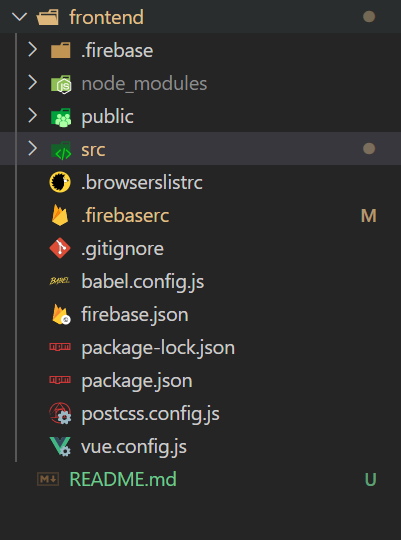

## 배포 사이트 https://ramzi-sooni.firebaseapp.com/

## FIREBASE & VUE

# ddddd

## 1. 처음 firebase 홈페이지에서 db와 연결하기

프로젝트 만들고 firestore 생성

앱 생성

앱 안에 설정에서 Firebase SDK snippet을 복사해 services내 FirebaseService.js에 붙여넣는다.

```
const firebaseConfig = {
	apiKey: "",
	authDomain: "ramzi-sooni.firebaseapp.com",
	databaseURL: "https://ramzi-sooni.firebaseio.com",
	projectId: "ramzi-sooni",
	storageBucket: "ramzi-sooni.appspot.com",
	messagingSenderId: "",
	appId: "",
	measurementId: ""
  };
```


## 2. Firebase 데이터베이스 및 백 구성하기

```
	postPortfolio(title, body, img) {
		return firestore.collection(PORTFOLIOS).add({
			title,
			body,
			img,
			created_at: firebase.firestore.FieldValue.serverTimestamp()
		})
```

portfolio라는 데이터 내에 필드로 title, body, img, created_at 필드가 들어있다


## 3. VUE  꾸미기

### 더보기 누르면 글이 4개 / 사진이 4개씩 더 나오게 하기


## 9. 배포하기

```
npm install
npm install -g @vue/cli
npm install vue
npm install -g firebase-tools

firebase login
firebase init - hosting - dist - spa
npm run build
firebase deploy
```


